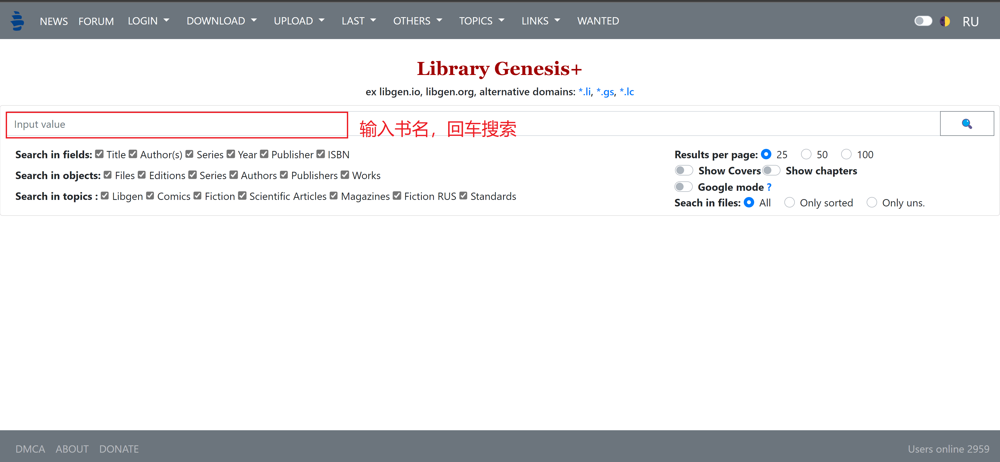
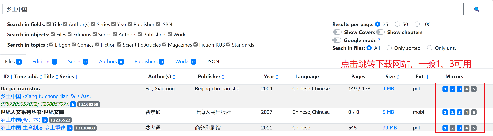
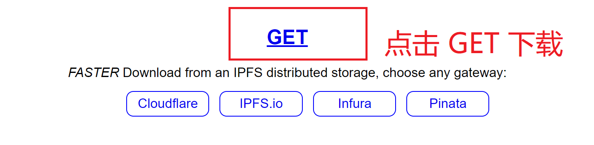

## Z-Library

**Z-Library 已被美国执法机构查封**

~~Z-Library 基于 LIBGEN 项目衍生而来，在原有书库的基础上进一步扩充了书籍了，国内外书籍均有，且在持续增长中。网站不收费但是接收捐赠。游客每日 5 本下载额度，注册用户 10 本，捐赠后可获得更多额度。Z-Library 有许多网站，[官网（国内无法访问）](http://z-lib.org/)。~~

~~虽然 Z-Library 很方便，但是官方网站已经无法在国内访问了。您可以使用代理工具，或者使用 zhelper 等免代理免登录的公共账号项目，[直达链接](https://www.zhelper.net/)。打开后选择快捷入口-随便选一个网址-点击访问即可进入 Z-Library 最新网址，且已经是登录状态，之后直接搜索下载即可。具体教程可以参考[教程](/post/zhelper)。使用工具后可以无限下载。部分书籍（主要是外文书）提示版权受限，可以使用 Tor 浏览器（需要配合代理）下载，[参考本文](https://yibook.org/post/zlib-tor/)。~~

与 Z-Library 相近的网站包括 [无产阶级图书管](https://library.proletarian.me/)，[LOREFREE](https://ebook2.lorefree.com/) 和 [LIBGEN](http://libgen.rs/)。~~但目前来看，LOREFREE 的网页访问速度很慢，LIBGEN 资源少于 Z-Library，且纯英文，无产阶级图书馆资源较少，教材类资源几乎没有。**所以这些网站我们不作主要推荐。**~~

<!-- ### zhelper 小组备份的 3000 本电子书

https://file.zhelper.de -->

### 使用 TOR 下载 Z-Library 书籍

TOR官网 https://www.torproject.org/

z 图 tor 地址 http://loginzlib2vrak5zzpcocc3ouizykn6k5qecgj2tzlnab5wcbqhembyd.onion/

您可能需要代理。

具体教程参考 [本文](https://bbs.yibook.org/d/206-hui-fu-xia-zai-fang-shi-2-shi-yong-tor-xia-zai-z-library-zi-yuan/32)

### 使用 安卓APP下载

APP 下载：[https://gofile.io/d/DHQwjr](https://gofile.io/d/DHQwjr)（可能需要代理才能使用）

### 使用 TG 机器人下载

参考 [本文](https://bbs.yibook.org/d/220-hui-fu-xia-zai-fang-shi-1-tong-guo-tg-ji-qi-ren-xia-zai-z-library-shu-ji)

### 使用备份网站下载

国内备份

[https://clibrary.top/](https://clibrary.top/)

[https://bk.hallowlib.org/](https://bk.hallowlib.org/)

国外备份（由 Pirate Library Mirror 项目发起人建立）

[https://annas-archive.org/](https://annas-archive.org/)

## Libgen

Z-Library 下位替代。这里也收集了三个网址。具体使用流程见图。

http://libgen.rs/

https://libgen.gs/

https://libgen.ee/







## 超星/全国图书馆参考咨询联盟

超星早年间承担了国内大学图书馆藏书数字化的工作，有一大批独家的 PDF 格式的扫描版电子书。**超星特别适合寻找 PDF 版本的大学教材**。

超星图书馆主要通过“全国图书馆参考咨询联盟”这个马甲对公众提供服务。登录[官网](http://www.ucdrs.superlib.net/)即可搜索超星图书馆的藏书。但是所有书籍最多只能试读 15 页，要下载需要使用文献传递，一次 45 页左右，一天一次。部分书籍甚至不提供文献传递按钮。

<!-- 但这并不意味着我们无法获取超星库里的书籍。简单来说，目前有人批量导出了超星书库，淘宝很多代找电子书商就是购买了这套书库。网上也有很多收费的（一般是2RMB/本）接口。所以之前我并不推荐这个渠道。 -->

不过，前一段时间我们找到了一个**免费的**超星接口，[直达链接](https://freembook.com/)。我们可以直接用书名搜索，也可以用 SS/DX 号搜索。得到的结果是秒传链接。按照网站的提示下载书籍即可。

如果您还是不太会用这个网站，或者不知道如何处理下载的结果，**[此处](https://ssdown.org/blog/quick/) 有更加详细的超星使用教程**，包括搜索、获取SS号、解密的全过程。可以作为参考。

## 淘链客/鸠摩搜索

淘链为网盘聚合型，搜索源包括夸克、百度等网盘。注意有些结果是假的。仔细识别。

[链接](https://www.toplinks.cc)，以及替代网站 [鸠摩搜索](https://www.jiumodiary.com/)。

你也可以直接使用[必应](https://cn.bing.com/)进行搜索。这在找寻 PDF 格式论文/笔记/电子书时非常有效。

以关键词 概率论 为例。我们可以直接搜索

```
概率论 filetype:pdf 
```

## 可知

以可知为代表的出版社直供的正版电子书平台。如果是机构用户可以看看，质量不错的。

[可知-国家知识服务平台可知分平台](/d/12kx)

详细的使用教程[参考本文](/post/keledge)

此外，科学出版社、机械工业出版社、人民邮电出版社等有自己专门的在线电子书平台，如果需要对应的电子书资源可以考虑使用，具体参考[出版社直供系列网站](https://yibook.org/tags/%E5%87%BA%E7%89%88%E7%A4%BE%E7%9B%B4%E4%BE%9B/)。


## 杂志下载 Magzinelib

全站免费，更新即时，全高清PDF。需要注意的是，这家的文件存在 VK（一个俄罗斯社交平台上），虽然是免费的，**但是有些过刊会被删除**。所以如果喜欢某本杂志的话，记得每期下载。

[官网](https://magazinelib.com/)

