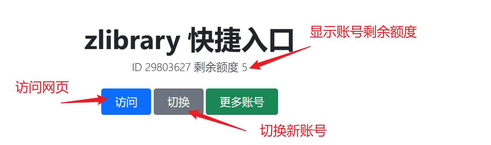
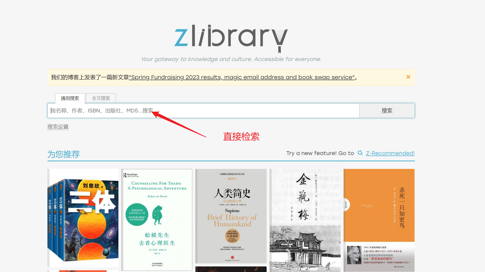
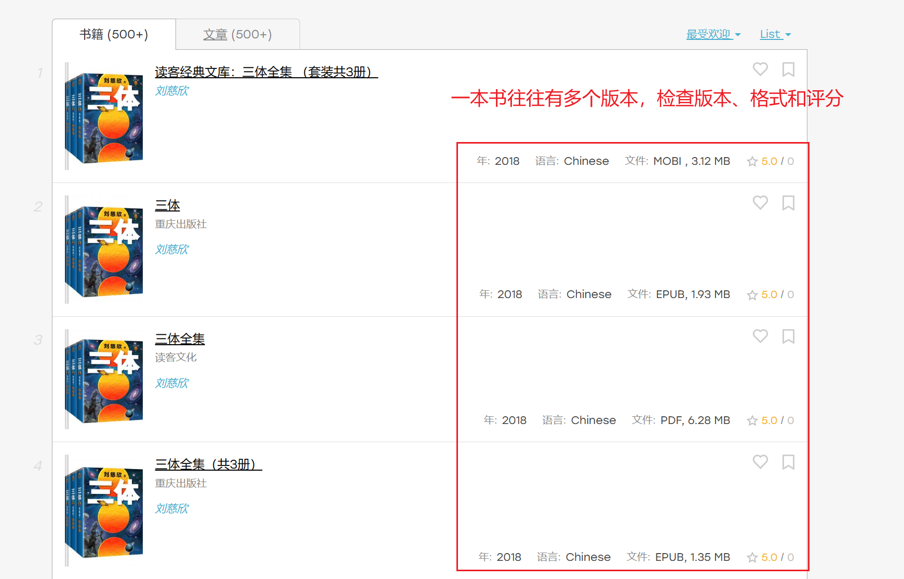
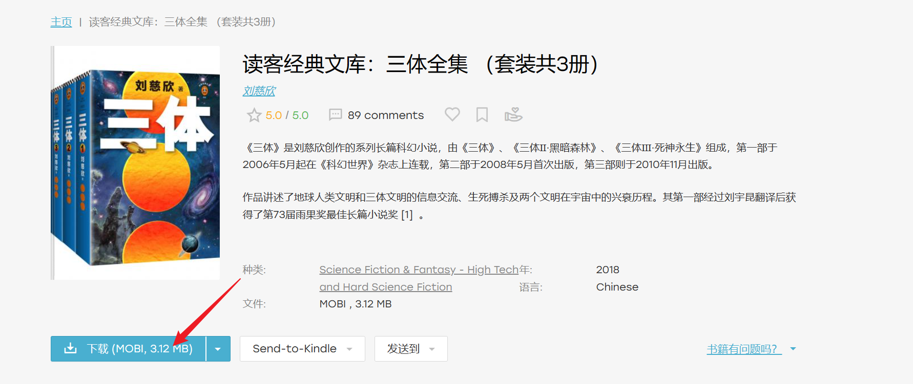
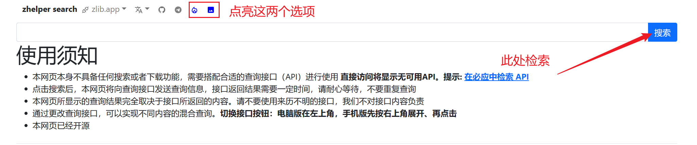

## 自有书库

### Z-Library

> 我们强烈建议您在搜索任何书籍时，首先检查 zlibrary。

Z-Library 是世界上最大的在线图书馆，提供免费下载电子书籍的服务。在去年年末之时，Z-Library 曾被美国执法机构查封。但是经过维护人员的不懈努力，目前，Z-Library 已经通过其他网址恢复访问，并且更新了官方的 [TG 频道](https://t.me/zlibrary_official)。不幸的是，最新的网址在发布之后，很快国内便无法直接访问这些网站，需要使用其他工具来访问。所以下面的教程也分为两部分。

1. 如果你有访问官方网站的方法：请直接访问 [登录界面](https://singlelogin.me/)，**完成注册之后**，即可享受每日 10 本的下载额度，捐赠后可获得更多额度。
2. 如果你没有此方法：请打开 [zlib镜像辅助工具](http://zlib.yibook.org/)，选择“访问”，即可借助**公共账号**访问 **zlibrary 镜像网站**。这意味着，你可以获取几乎**无限的下载量**，仅仅需要在回到辅助工具使用“切换”生成另外一个账户，但是也意味着你**不能使用捐赠、发送到邮箱、转格式等功能**。




登录之后的过程十分简单：







**相关资料**

1. 与 Z-Library 相近的网站包括 [无产阶级图书馆](https://library.proletarian.me/)，[LOREFREE](https://ebook2.lorefree.com/) 和 [LIBGEN](http://libgen.rs/)。
2. 如果您需要更多镜像网站，可以访问 [镜像检测](http://mirror.yibook.org/)，包括 zlib 和 libgen 的镜像网站，且支持实时监测。
3. **如果您需要大量下载书籍，建议使用备份网站下载，不消耗额度**（备份网站的内容仅更新至 2022 年 12 月）：国内备份包括 [ylibrary](https://ylibrary.org/)、 [clibrary](https://clibrary.cn/) 和 [hallowlib](https://bk.hallowlib.org/)；国外备份（由 Pirate Library Mirror 项目发起人建立，**推荐**）：[annas-archive](https://annas-archive.org/)
4. 部分 Z-Library 书籍需要使用 TOR 下载（您可能需要代理）。TOR官网 https://www.torproject.org/ ， z 图 tor 地址 http://loginzlib2vrak5zzpcocc3ouizykn6k5qecgj2tzlnab5wcbqhembyd.onion/ 。具体教程参考 [本文](https://bbs.yibook.org/d/206-hui-fu-xia-zai-fang-shi-2-shi-yong-tor-xia-zai-z-library-zi-yuan/32)
5. 使用 安卓APP下载（您可能需要代理）。APP 下载：[https://gofile.io/d/DHQwjr](https://gofile.io/d/DHQwjr)
6. 使用 TG 机器人下载（机器人具有额外的额度配置）：具体请参考 [本文](https://bbs.yibook.org/d/220-hui-fu-xia-zai-fang-shi-1-tong-guo-tg-ji-qi-ren-xia-zai-z-library-shu-ji)

### Libgen

Z-Library 下位替代。这里也收集了三个网址。与 zlibrary 相比， libgen 没有所谓的额度限制。

- http://libgen.rs/
- https://libgen.gs/
- https://libgen.ee/

具体使用流程见图。


**相关资料**

1. 如果您需要更多镜像网站，可以访问 [镜像检测](http://mirror.yibook.org/)，包括 zlib 和 libgen 的镜像网站，且支持实时监测。

### 超星/全国图书馆参考咨询联盟

> 我们强烈建议您在搜索任何书籍时，其次检查超星。

超星早年间承担了国内大学图书馆藏书数字化的工作，有一大批独家的 PDF 格式的扫描版电子书。**超星特别适合寻找 PDF 版本的大学教材**。

超星图书馆主要通过“全国图书馆参考咨询联盟”这个马甲对公众提供服务。登录[官网](http://www.ucdrs.superlib.net/)即可搜索超星图书馆的藏书。**但是所有书籍最多只能试读 15 页，要下载需要使用文献传递，一次 45 页左右，一天一次。部分书籍甚至不提供文献传递按钮。**

但是市面上也有一些流出的超星书库（或者叫做秒传书库），并几经转手之后被发布到了网上。这些书库里面虽然不是全部的超星图书，但也很值得使用。目前我们收集到的一些**免费的接口**包括。

- [S-lib](https://s-lib.ylibrary.org/)
- [Freembook](https://freembook.com/)
- [找书网](https://findbooks.eu.org/)

我们可以直接用书名搜索，也可以用 [SS/DX 号](https://ssdown.org/blog/dxandss/) 搜索。得到的结果是[秒传链接](https://mengzonefire.code.misakanet.cn/rapid-upload-userscript-doc/document/Info/%E8%84%9A%E6%9C%AC%E8%AF%B4%E6%98%8E.html#%E8%84%9A%E6%9C%AC%E4%BB%8B%E7%BB%8D)。按照网站的提示下载书籍即可。

**请注意，从超星下载书籍需要经过秒传转存、压缩包解密和转格式等一系列操作。[此处](https://ssdown.org/blog/quick/) 有更加详细的超星使用教程**，包括搜索、获取SS号、解密的全过程。可以作为参考。


**相关资料**

1. [全国图书馆参考咨询联盟/超星电子书库研究分享](https://ssdown.org/)
2. [秒传链接提取脚本](https://mengzonefire.code.misakanet.cn/rapid-upload-userscript-doc/)
3. [Superlib 书籍解密与格式转换指南（持续更新）](https://ssdown.org/blog/solve/)


### 可知、文泉、畅想之星

以可知为代表的出版社直供的正版电子书平台。如果是机构用户可以看看，质量不错的。

[可知-国家知识服务平台可知分平台](/d/12kx)

详细的使用教程[参考本文](/post/keledge)

此外，科学出版社、机械工业出版社、人民邮电出版社等有自己专门的在线电子书平台，如果需要对应的电子书资源可以考虑使用，具体参考[出版社直供系列网站](https://yibook.org/tags/%E5%87%BA%E7%89%88%E7%A4%BE%E7%9B%B4%E4%BE%9B/)。有消息称此部分电子书能够通过软件获取全本，不能确保真实性。


**相关资料**

1. [科学文库：高清PDF格式电子版教材及其解密](https://blog.yibook.org/post/sciencereading/)

## 网盘/链接聚合

### 淘链客/鸠摩搜索 等

淘链客为网盘聚合型，搜索源包括夸克、百度等网盘。注意有些结果可能并不准确。

[链接](https://www.toplinks.cc)，以及替代网站 [鸠摩搜索](https://www.jiumodiary.com/)。

### Bing/Google

你也可以直接使用[必应](https://cn.bing.com/)进行搜索。这在找寻 PDF 格式论文/笔记/电子书时非常有效。

以关键词 概率论 为例。我们可以直接搜索

```
概率论 filetype:pdf 
```

直接借助搜索引擎往往是我们最后的手段。

## 融合检索


融合检索工具本身不提供书籍的存储和下载服务，只是聚合了几个书站的资源，方便我们进行查找。此处以 zhelper search 为例介绍融合检索。

访问 [此链接](https://search.zhelper.net/?[{%22name%22:%22zlib.app%22,%22url%22:%22https://worker.zlib.app%22,%22type%22:%22full%22,%22sensitive%22:false,%22detail%22:false,%22download%22:%22https://worker.zlib.app/download/%22},{%22name%22:%22pdfdrive%22,%22url%22:%22https://pdfdrive.bookpan.net%22,%22sensitive%22:false,%22detail%22:false,%22display%22:{%22h%22:[%22title%22],%22p1%22:[%22year%22,%22pages%22],%22p2%22:[%22sizestring%22,%22id%22],%22detail%22:[%22md5%22]}},{%22name%22:%22Ylibrary%22,%22url%22:%22https://zlibrary.ylibrary.org%22,%22type%22:%22full%22,%22sensitive%22:false,%22detail%22:true},{%22name%22:%22Ylibrary%22,%22url%22:%22https://superlib.ylibrary.org%22,%22type%22:%22full%22,%22sensitive%22:false,%22detail%22:true},{%22name%22:%22bookpan%22,%22url%22:%22https://api.bookpan.net%22,%22type%22:%22light%22,%22sensitive%22:false,%22detail%22:true}])，在新页面中，选中“增强模式”和“展示图片”两个选项（点亮图中的两个图标），**此时搜索任何关键词，即可同时检索 zlibrary、超星、pdfdrive 等书库，返回全部结果，此方式特别适合用于检索冷门书籍**




zhelper search 的缺点也很明显：相较其他网站，美观度、功能上都有不足，且检索功能严重依赖于其融合的书站。但是我仍然建议大家使用此工具：毕竟可以节省很多切换不同地址进行搜索的时间。

<!-- ## 书站导航 -->


## 其他

### 杂志下载 

1. Magzinelib：目前国内最广为人知的杂志网站。全站免费，更新即时，全高清PDF。需要注意的是，这家的文件存在 VK（一个俄罗斯社交平台上），虽然是免费的，**但是有些过刊会被删除**。所以如果喜欢某本杂志的话，记得每期下载。[官网](https://magazinelib.com/)。
2. freemagazines：相较前者，此网站虽名不见经传，但经过测试，资源齐全、下载方便，也非常推荐！[点此访问](https://freemagazines.top/)。


### 论文下载

zlibrary 具有论文模块，需要在官网选择“文章”进行访问。

此外，对于一些时间较早的文章，Sci-hub 是非常不错的选择。

